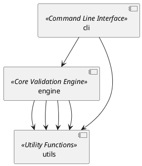
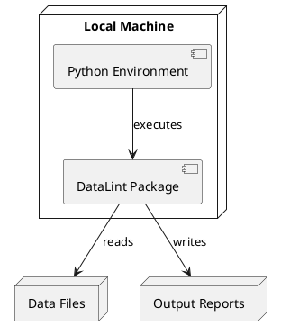
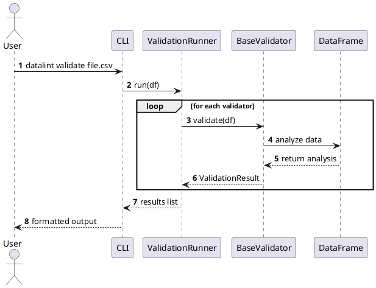
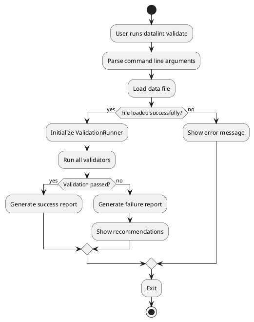
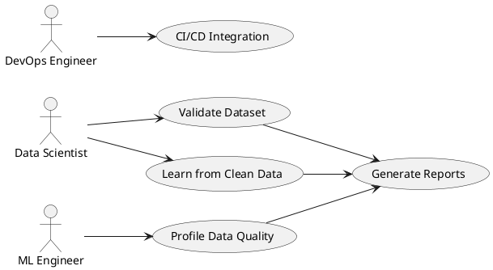

<p align="center">
  
</p>

<h1 align="center">DataLint</h1>

<p align="center">
  <strong>Automated data validation for ML teams</strong><br>
  Find data quality issues before they break your models.
</p>

<p align="center">
  <a href="https://www.python.org/downloads/"></a>
  <a href="LICENSE.md"></a>
  <a href="#installation"></a>
</p>

---

## Overview

DataLint learns from clean datasets to automatically validate new data and prevent ML training failures. It catches the data quality issues that cause **60% of ML project failures** before they break your models.

### Key Features

| Feature | Description |
|---------|-------------|
| **Zero Configuration** | Works out of the box with sensible defaults |
| **ML-Focused** | Optimized specifically for model training data quality |
| **Learn from Data** | Automatically generates validation rules from clean datasets |
| **Schema Drift Detection** | Catches when production data differs from training data |
| **CI/CD Ready** | JSON output for integration with automated pipelines |

---

## Installation

```bash
pip install datalint
```

**Requirements**: Python 3.8+

---

## Quick Start

### Validate a Dataset

```bash
datalint validate mydata.csv
```

**Output:**
```
Loaded dataset: 150 rows x 5 columns

  missing_values: No missing values found
  data_types: Data types appear consistent
  outliers: Outlier levels appear normal
  correlations: Found 1 highly correlated feature pairs
  constant_columns: Found 1 columns with constant values

Summary: 3 passed, 1 warnings, 1 failed
Tip: Address failed checks before training ML models
```

### Learn from Clean Data

```bash
# Create a validation profile from your training data
datalint profile training_data.csv --learn

# Validate new data against the learned profile
datalint profile new_data.csv --profile training_data_profile.json
```

### Export for CI/CD

```bash
datalint validate data.csv --format json --output results.json
```

---

## What It Checks

DataLint performs five core validation checks:

### 1. Missing Values
Identifies columns with excessive null values that will crash or degrade ML models.

```python
# Example: 43% missing values in 'age' column
# Recommendation: Impute or remove before training
```

### 2. Data Type Consistency
Detects mixed types (e.g., numbers and text in the same column) that cause parsing errors.

```python
# Example: price column has [10.99, 25.50, 'FREE', 15.00]
# Recommendation: Convert to consistent type
```

### 3. Outlier Detection
Uses the IQR (Interquartile Range) method to find statistical anomalies that can dominate model training.

```python
# Example: salary column has values [50k, 55k, 48k, 5M]
# Recommendation: Investigate or cap extreme values
```

### 4. High Correlations
Finds feature pairs with >95% correlation that provide redundant information.

```python
# Example: height_cm and height_inches are 100% correlated
# Recommendation: Remove one redundant feature
```

### 5. Constant Columns
Detects columns with zero variance that provide no predictive information.

```python
# Example: 'country' column is 'USA' for all rows
# Recommendation: Remove before training
```

---

## Comparison with Other Tools

| Feature | DataLint | Great Expectations | Pandera | Deequ |
|---------|----------|-------------------|---------|-------|
| Zero config | Yes | No (YAML required) | No (schema required) | No |
| Auto-learn rules | Yes | No | No | Partial |
| ML-focused | Yes | General | General | General |
| Setup time | 5 minutes | Hours/Days | Hours | Hours |
| Pricing | Free | Free | Free | Free (AWS) |

---

## Architecture

```
datalint/
├── cli.py              # Command-line interface
├── engine/
│   ├── validators.py   # Core validation checks
│   ├── learner.py      # Rule learning from clean data
│   └── profiler.py     # Statistical profiling
└── utils/
    ├── io.py           # File loading (CSV, Excel, Parquet)
    └── reporting.py    # Output formatter (text, JSON, HTML)
```

### Architecture Diagrams

#### Component Diagram
*Illustrates high-level software components*



#### Deployment Diagram
*Shows how the system is deployed*



#### Sequence Diagram
*Displays the validation workflow sequence*



#### Activity Diagram
*Shows the validation pipeline activities*



#### Use Case Diagram
*Illustrates user interactions with the system*




---

## Roadmap

- [x] **Phase 1**: Core validation engine with CLI
- [ ] **Phase 2**: Learning system (auto-generate rules from clean data)
- [ ] **Phase 3**: HTML reports + GitHub Actions integration
- [ ] **Phase 4**: Web dashboard + team collaboration

---

## Contributing

DataLint is in active development. We welcome contributions:

- **Bug Reports**: Open an issue with reproduction steps
- **Feature Requests**: Describe your use case
- **Pull Requests**: See `CONTRIBUTING.md` for guidelines
- **Feedback**: Share your experience using DataLint

---

## License

MIT License - see [LICENSE](LICENSE) for details.

---

<p align="center">
  <strong>DataLint</strong> - Because good models start with good data.
</p>
